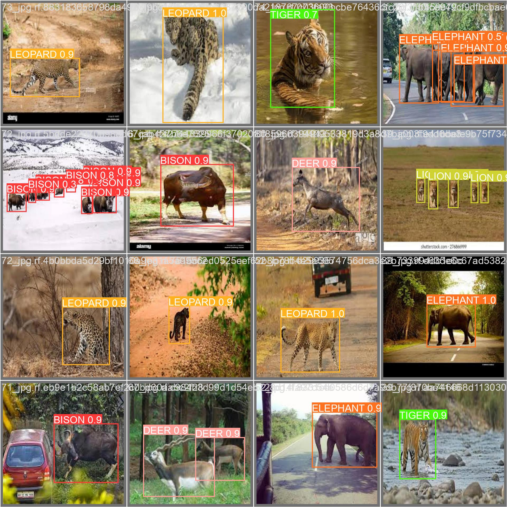

# Fine-Tuning YOLOv8 Project

This project focuses on fine-tuning the YOLOv8 model to expand its recognition capabilities for wildlife species. The base model initially recognized common animals like `{'bird', 'cat', 'dog', 'horse', 'sheep', 'cow', 'elephant', 'bear', 'zebra', 'giraffe'}`.  

To push its boundaries, I trained the model on a **custom dataset of 4,000 images**, introducing new species such as `['BISON', 'DEER', 'ELEPHANT', 'LEOPARD', 'LION', 'TIGER']`. This expanded the model’s recognition capabilities, making it more versatile for wildlife conservation and monitoring.

## Key Highlights
- **Fine-Tuning YOLOv8:** Trained the pre-trained `YOLOv8l.pt` model on a custom wildlife dataset to improve its recognition of new species.
- **Performance Benchmarking:** Trained an **InceptionResNetV2** model to compare its performance against YOLOv8.  
  - The saved **InceptionResNetV2 pickle file** can be accessed via the [Google Drive link](https://drive.google.com/drive/folders/1z1sIb1ZrmX6HVlKe2ohGV9dlWWT9qXX7?usp=sharing).
- **Results & Resources:**  
  - YOLO Wildlife image dataset, weights, and results are available through the [Google Drive link](https://drive.google.com/drive/folders/1z1sIb1ZrmX6HVlKe2ohGV9dlWWT9qXX7?usp=sharing).
  - Results demonstrate the expanded recognition capabilities and improved detection accuracy.

## Results
### YOLOv8 Detection Results

## Repository Details
This repository includes:
- **Dataset (Source: Roboflow):** Custom YOLO wildlife image dataset with 4,000 images of diverse species.
- **Weights:** YOLOv8 fine-tuned weights and training artifacts.
- **Benchmarking Files:** Pickle files and performance metrics for InceptionResNetV2.

## Why YOLOv8?
The YOLOv8 model was chosen for its simplicity, real-time capabilities, and ease of use. Ultralytics’ straightforward **documentation** and intuitive **CLI commands** made the entire process seamless. The **checkpoint-saving feature** was a lifesaver, allowing me to resume training after GPU disconnections without losing progress.

## Technologies Used
- **YOLOv8:** Fine-tuned for real-time object detection.
- **InceptionResNetV2:** Used as a benchmark for performance comparison.
- **Frameworks & Tools:** TensorFlow, PyTorch, OpenCV, Python.
